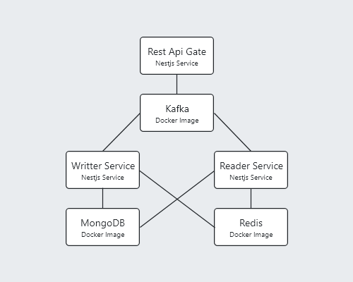

# Microservice Architecture
This is a simple example of microservice acrhitecture with nestjs framework 

the implements of microservice architecture it's little hard to do this example it's will good for the starters

## Usings
- Apache Kafka as message broker
- Mongodb as database
- Redis as cache database
- Docker as context of execute microservices

## this is map of microservices

enjoy coding and share information with me <a href="https://telegram.me/vaghardoost">My Telegram Link</a>
